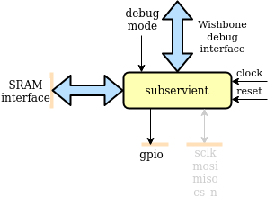
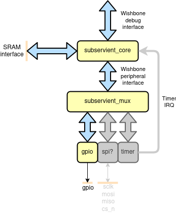
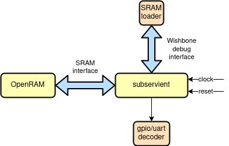

# subservient
Small SERV-based SoC primarily for OpenMPW tapeout

## Introduction

Subservient is a small SoClet around the award-winning SERV, the world's smallest RISC-V CPU intended to be used for ASIC implementations. The SoClet exposes a port intended to be connected to be connected to an SRAM used for both the register file and data/instruction memory, a debug interface for external access to the SoC memory map and GPIO.

## Architecture

### Top-level

The top-level of Subservient consists of the subservient_core component which contains all the vital SoC infrastructure, and the standard peripheral controllers, currently only consisting of GPIO. This is a convenience wrapper for users who are happy with the standard set of peripherals.

### Subservient core

Subservient core contains SERV and the necessary components to use a single SRAM for SERV's register file, data and instruction memories. It also routes all memory accesses >=0x40000000 to the wishbone peripheral interface. In the debug mode, the debug interface takes over the accesses from SERV. This allows an external wishbone master to access all subservient peripherals as well as programming the SRAM through this interface.

### Testbench

Subservient comes with a simple testbench that allows running programs on the simulated SoC and monitor its outputs either as a GPIO or as a UART. The testbench flow is as follows:

1. Subservient is started up in debug mode by asserting debug_mode. This prevents the CPU from accessing the SRAM until we are ready for that.
2. Reset is released
3. The SRAM is written through the debug interface from a user-specified file in the verilog hex format.
4. Debug mode is turned off
5. CPU starts executing from the program written to SRAM

## Getting started

Subservient uses [FuseSoC](https://github.com/olofk/fusesoc) to handle its dependencies and run the SoC through different tool flows.

1. Install FuseSoC `pip3 install fusesoc`
2. Create an empty workspace directory and enter it `mkdir workspace && cd workspace`
3. From within your workspace directory add the required FuseSoC libraries
   - Base library `fusesoc library add fusesoc-cores https://github.com/fusesoc/fusesoc-cores`
   - SERV `fusesoc library add serv https://github.com/olofk/serv`
   - Subservient `fusesoc library add subservient https://github.com/olofk/subservient`
4. FuseSoC should be able to see the subservient SoC. Verify this by running `fusesoc core show subservient`
5. We can now run a simulation with the simulator we have at hand. `fusesoc run --target=sim --tool=icarus subservient` will launch a simulation using Icarus Verilog. Changing `--tool`to e.g. modelsim will use Modelsim/questasim instead.

TODO:
- [ ] Test on FPGA
- [ ] Add OpenRAM
- [ ] Add support for loading the SRAM externally (over Wishbone from Caravel)
- [ ] Gate-level simulations
